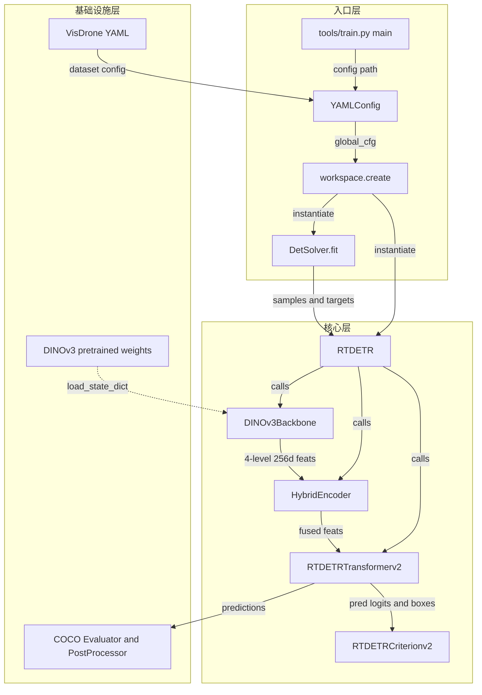
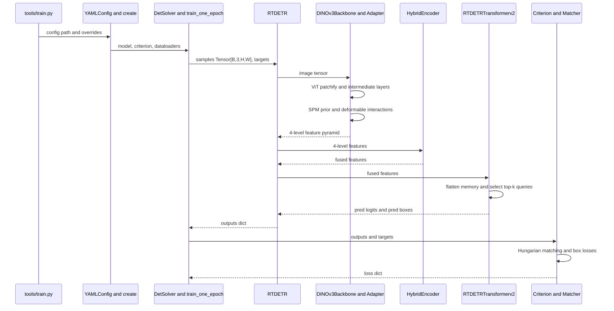
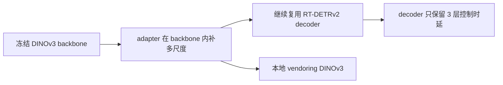

# RT-DETRv2 PyTorch + DINOv3 架构分析

## 概览

这个子项目本质上是一个配置驱动的 RT-DETRv2 检测框架。当前分支不是简单把 CNN backbone 替换成 ViT，而是把 DINOv3 接成一条完整的检测主干链路：冻结的 DINOv3 ViT-B/16 提供语义特征，DINOv3FPNAdapter 负责把单尺度 ViT 特征恢复成 4 个尺度的检测特征金字塔，随后继续复用 RT-DETRv2 的 HybridEncoder、Transformer decoder、Hungarian matching 和端到端损失定义。

整体装配入口很轻，主要复杂度集中在两处：

- DINOv3 多尺度适配器
- RT-DETRv2 解码器

典型装配链路如下：

- `tools/train.py`
- `src/core/yaml_config.py`
- `src/core/workspace.py`
- `src/solver/det_solver.py`
- `src/zoo/rtdetr/rtdetr.py`

## P1 全局拓扑

### 目录与核心模块

- 入口层
  - `tools/train.py`
- 配置与注册层
  - `configs/rtdetrv2/rtdetrv2_dinov3b_visdrone.yml`
  - `src/core/yaml_config.py`
  - `src/core/workspace.py`
- 训练调度层
  - `src/solver/_solver.py`
  - `src/solver/det_solver.py`
  - `src/solver/det_engine.py`
- 模型核心层
  - `src/zoo/rtdetr/rtdetr.py`
  - `src/zoo/rtdetr/hybrid_encoder.py`
  - `src/zoo/rtdetr/rtdetrv2_decoder.py`
  - `src/zoo/rtdetr/rtdetrv2_criterion.py`
  - `src/zoo/rtdetr/matcher.py`
  - `src/zoo/rtdetr/rtdetr_postprocessor.py`
- DINOv3 接入层
  - `src/nn/backbone/dinov3_combined.py`
  - `src/nn/backbone/dinov3_model.py`
  - `src/nn/backbone/dinov3_adapter.py`
- 本地 vendored DINOv3 子树
  - `src/nn/backbone/dinov3/hub/backbones.py`
  - `src/nn/backbone/dinov3/models/vision_transformer.py`

### 模块量化

| 模块 | 职责定义 | 代码量级 | 公共接口 | 设计亮点 | 依赖方向 |
|---|---|---:|---|---|---|
| core | 配置加载与依赖注入 | 5 文件 / 770 行 | `YAMLConfig`, `create` | 用注册表做声明式装配 | 被 tools、solver、zoo、nn 依赖 |
| solver | 训练与评估调度 | 6 文件 / 638 行 | `fit`, `val`, `train_one_epoch`, `evaluate` | 将模型、损失、后处理解耦 | 依赖 core、data、zoo |
| zoo/rtdetr | 检测器主体 | 13 文件 / 2766 行 | `RTDETR`, `HybridEncoder`, `RTDETRTransformerv2` | 保持 RT-DETRv2 主体稳定，仅替换 backbone 契约 | 依赖 nn/backbone、core |
| DINOv3 接入层 | ViT 检测桥接 | 3 文件 / 636 行 | `DINOv3Backbone`, `DINOv3Model`, `DINOv3FPNAdapter` | 冻结 ViT + adapter 直接输出 4-level 特征 | 被 RTDETR 调用 |
| DINOv3 本地子树 | 提供原生 ViT 实现 | 17 文件 / 1840 行 | `dinov3_vitb16`, `DinoVisionTransformer` | 直接 vendoring，避免外部依赖漂移 | 被 DINOv3Model 调用 |

### Mermaid 全局拓扑



### 健康度速查

- 跨层调用基本保持单向流动：入口层 -> 配置层 -> solver -> model。
- 当前没有超过 1000 行的 God Module，但复杂度显著集中在 `src/zoo/rtdetr/rtdetrv2_decoder.py` 和 `src/nn/backbone/dinov3_adapter.py`。
- `rtdetrv2_decoder.py` 约 609 行，是最复杂的检测模块。
- `dinov3_adapter.py` 约 442 行，是 DINOv3 集成的核心复杂点。
- 当前子项目测试覆盖较弱，未见独立 tests 目录，说明主要依赖实验结果而非单元测试约束架构演进。

## P2 关键路径

### 路径选择

选取“训练态一个 batch 从输入图像到损失张量”的链路。理由是这条路径会完整穿过 DINOv3 backbone、adapter、HybridEncoder、RT-DETRv2 decoder、Hungarian matching 和损失函数，是理解该分支网络架构的最典型路径。

### 逐层追踪

| 层级 | 文件 | 函数 | 输入 -> 输出 |
|---|---|---|---|
| 入口 | `tools/train.py` | `main` | CLI 参数 -> `YAMLConfig` -> `DetSolver` |
| 配置装配 | `src/core/yaml_config.py` | `YAMLConfig.model` | YAML -> 已实例化的 `RTDETR` |
| 注册创建 | `src/core/workspace.py` | `create` | schema dict -> module instance |
| 训练循环 | `src/solver/det_engine.py` | `train_one_epoch` | `samples, targets` -> `outputs` -> `loss_dict` |
| 总模型 | `src/zoo/rtdetr/rtdetr.py` | `RTDETR.forward` | `Tensor[B,3,H,W]` -> prediction dict |
| DINOv3 主干 | `src/nn/backbone/dinov3_combined.py` | `DINOv3Backbone.forward` | 图像 -> 4-level 特征列表 |
| ViT 包装 | `src/nn/backbone/dinov3_model.py` | `DINOv3Model.forward` | 图像 -> 多层 ViT 特征 |
| ViT 本体 | `src/nn/backbone/dinov3/models/vision_transformer.py` | `get_intermediate_layers` | patch tokens -> 指定 block 中间特征 |
| 多尺度桥接 | `src/nn/backbone/dinov3_adapter.py` | `DINOv3FPNAdapter.forward` | 图像 -> 4 个尺度的 256 通道特征 |
| 颈部融合 | `src/zoo/rtdetr/hybrid_encoder.py` | `HybridEncoder.forward` | 4-level 特征 -> 编码与 FPN/PAN 融合后的特征 |
| 编码器输入准备 | `src/zoo/rtdetr/rtdetrv2_decoder.py` | `_get_encoder_input` | 特征图列表 -> flatten memory 和 spatial shapes |
| Query 初始化 | `src/zoo/rtdetr/rtdetrv2_decoder.py` | `_get_decoder_input` | memory -> top-k query 与初始 anchor |
| 解码器前向 | `src/zoo/rtdetr/rtdetrv2_decoder.py` | `forward` | feats, targets -> `pred_logits`, `pred_boxes`, `aux_outputs` |
| 匹配与损失 | `src/zoo/rtdetr/rtdetrv2_criterion.py` | `forward` | outputs, targets -> 损失字典 |
| 匹配器 | `src/zoo/rtdetr/matcher.py` | `forward` | queries 与 GT -> Hungarian 匹配索引 |

### DINOv3 与 RT-DETRv2 的完整网络结构

#### 1. DINOv3 Backbone

当前配置使用 `dinov3_vitb16`：

- patch size = 16
- embed dim = 768
- depth = 12
- num heads = 12

源码位置：

- `src/nn/backbone/dinov3/hub/backbones.py`
- `src/nn/backbone/dinov3/models/vision_transformer.py`

它本身天然只提供单尺度 token 特征，不适合直接输入检测头。

#### 2. DINOv3 Adapter

适配器做了三件事：

- 用 SpatialPriorModule 从输入图像抽取 1/4、1/8、1/16、1/32 空间先验
- 用 ViT 中间层特征和空间先验做多轮可变形注意力交互
- 将输出统一投影到 256 通道，直接形成 4-level 检测特征

这意味着当前 `DINOv3Backbone` 的语义不是“ViT backbone”，而是“冻结 ViT + interaction adapter 的组合主干”。

#### 3. HybridEncoder

HybridEncoder 的职责没有被彻底改写，仍然沿用 RT-DETRv2 的两段式结构：

- 在指定尺度上做 transformer 编码
- 之后走 top-down FPN 和 bottom-up PAN 融合

在当前 DINOv3 配置里：

- `in_channels = [256, 256, 256, 256]`
- `feat_strides = [4, 8, 16, 32]`
- `use_encoder_idx = [3]`
- `num_encoder_layers = 1`

也就是说，只对最高语义层做一次 transformer 编码，其余尺度主要靠卷积式跨层融合。

#### 4. RT-DETRv2 Decoder

解码器仍然是 RT-DETRv2 原生思路：

- flatten 多尺度 memory
- 基于 anchor 生成 encoder 输出候选
- 选 top-k query
- 通过多层 deformable decoder 逐层 refine box

当前 DINOv3 配置中：

- `feat_strides = [4, 8, 16, 32]`
- `num_levels = 4`
- `num_layers = 3`
- `num_points = [4, 4, 4, 4]`

这和标准 R50 配置的 3-level、6-layer 明显不同，是一个偏实时性的折中。

### 张量尺寸变化

#### 说明范围

- 训练时输入分辨率会随 multi-scale 策略变化，不是固定 640。
- 下面同时给出通用公式和当前 `eval_spatial_size = [640, 640]` 下的具体尺寸。
- 以下主要描述主检测分支尺寸；训练时若启用 denoising，会临时拼接额外 query，但最终主分支输出尺寸不变。

#### 0. 配置基线

- 输入图像：`x ∈ [B, 3, H, W]`
- 当前验证默认：`H = W = 640`
- DINOv3 patch size：`P = 16`
- DINOv3 embed dim：`C_vit = 768`
- 检测 hidden dim：`C_det = 256`
- 检测 query 数：`Q = 300`
- 当前 VisDrone 类别数：`num_classes = 11`

#### 1. DINOv3 ViT 主干内部尺寸

输入图像先经过 patch embedding，形成 patch token 网格：

- patch 网格尺寸：`H_p = H / 16`, `W_p = W / 16`
- patch token 数：`N = H_p * W_p`
- patch token 张量：`[B, N, 768]`

当前 DINOv3 模型还带有：

- 1 个 class token
- 4 个 storage tokens

因此 block 内部完整 token 序列长度为：

- `N_full = N + 5`

对 `640 x 640` 输入：

- `H_p = W_p = 40`
- `N = 1600`
- block 内部完整 token 序列：`[B, 1605, 768]`
- `get_intermediate_layers(..., return_class_token=True)` 返回的 patch token 为 `1600` 个，不包含 class/storage token。

#### 2. SpatialPriorModule 尺寸变化

适配器中的 SpatialPriorModule 从原图直接抽取 4 个空间层级：

| 分支 | 通用尺寸 | `640 x 640` 示例 | 说明 |
|---|---|---|---|
| `c1` | `[B, 768, H/4, W/4]` | `[B, 768, 160, 160]` | 由 stem + maxpool 生成 |
| `c2` | `[B, H/8*W/8, 768]` | `[B, 6400, 768]` | flatten 后的 stride-8 空间先验 |
| `c3` | `[B, H/16*W/16, 768]` | `[B, 1600, 768]` | flatten 后的 stride-16 空间先验 |
| `c4` | `[B, H/32*W/32, 768]` | `[B, 400, 768]` | flatten 后的 stride-32 空间先验 |

拼接后得到交互用的空间先验 token：

- `c = cat(c2, c3, c4)`
- 通用尺寸：`[B, H/8*W/8 + H/16*W/16 + H/32*W/32, 768]`
- `640 x 640` 时：`[B, 8400, 768]`

#### 3. ViT 中间层与 Adapter 交互尺寸

适配器会从 DINOv3 的后 4 个 block 提取中间特征，并与空间先验交互。

每个被提取的 ViT 中间层 patch token 尺寸为：

- `[B, H/16*W/16, 768]`
- `640 x 640` 时为 `[B, 1600, 768]`

交互结束后，adapter 将空间先验重新还原为 4 个二维特征图：

| 特征 | 通用尺寸 | `640 x 640` 示例 |
|---|---|---|
| `c1` | `[B, 768, H/4, W/4]` | `[B, 768, 160, 160]` |
| `c2` | `[B, 768, H/8, W/8]` | `[B, 768, 80, 80]` |
| `c3` | `[B, 768, H/16, W/16]` | `[B, 768, 40, 40]` |
| `c4` | `[B, 768, H/32, W/32]` | `[B, 768, 20, 20]` |

其中：

- `c1 = up(c2) + c1_prior`，把 stride-8 特征上采样回 stride-4
- 4 个 ViT 中间层输出也会插值到上述 4 个尺度，再与 `c1~c4` 相加

最后通过 `output_proj` 统一投影到 256 通道，形成 backbone 对外输出：

| Backbone 输出 | 通用尺寸 | `640 x 640` 示例 |
|---|---|---|
| `P4` | `[B, 256, H/4, W/4]` | `[B, 256, 160, 160]` |
| `P8` | `[B, 256, H/8, W/8]` | `[B, 256, 80, 80]` |
| `P16` | `[B, 256, H/16, W/16]` | `[B, 256, 40, 40]` |
| `P32` | `[B, 256, H/32, W/32]` | `[B, 256, 20, 20]` |

#### 4. HybridEncoder 尺寸变化

HybridEncoder 首先对 4 个尺度做 `1x1 conv` 投影，但当前输入本来就是 256 通道，因此主要改变的是特征语义，不改变尺寸：

| 阶段 | 通用尺寸 | `640 x 640` 示例 |
|---|---|---|
| 输入 `P4` | `[B, 256, H/4, W/4]` | `[B, 256, 160, 160]` |
| 输入 `P8` | `[B, 256, H/8, W/8]` | `[B, 256, 80, 80]` |
| 输入 `P16` | `[B, 256, H/16, W/16]` | `[B, 256, 40, 40]` |
| 输入 `P32` | `[B, 256, H/32, W/32]` | `[B, 256, 20, 20]` |

当前配置 `use_encoder_idx = [3]`，因此只对最后一级 `P32` 做 transformer 编码：

- flatten 前：`[B, 256, H/32, W/32]`
- flatten 后：`[B, H/32*W/32, 256]`
- `640 x 640` 时：`[B, 400, 256]`

之后经过 top-down FPN 和 bottom-up PAN，输出尺度保持不变：

- `[B, 256, H/4, W/4]`
- `[B, 256, H/8, W/8]`
- `[B, 256, H/16, W/16]`
- `[B, 256, H/32, W/32]`

#### 5. RT-DETRv2 Decoder 输入尺寸

Decoder 会把 4 个尺度全部 flatten 并拼接成 encoder memory：

- memory 长度

$$
L = \frac{H}{4}\frac{W}{4} + \frac{H}{8}\frac{W}{8} + \frac{H}{16}\frac{W}{16} + \frac{H}{32}\frac{W}{32}
$$

- memory 张量：`[B, L, 256]`

对 `640 x 640`：

$$
L = 160\times160 + 80\times80 + 40\times40 + 20\times20 = 34000
$$

因此：

- encoder memory：`[B, 34000, 256]`
- `spatial_shapes = [[160, 160], [80, 80], [40, 40], [20, 20]]`

#### 6. Query 选择与 Decoder 输出尺寸

Encoder 输出经过分类头和框回归头后，从 `L = 34000` 个候选位置中选择 top-k query：

- query content：`[B, 300, 256]`
- reference boxes：`[B, 300, 4]`

每一层 decoder 的主检测分支输出尺寸为：

- 分类 logits：`[B, 300, num_classes]`
- 框回归：`[B, 300, 4]`

当前 VisDrone 配置下：

- 分类 logits：`[B, 300, 11]`
- 框：`[B, 300, 4]`

由于当前 `num_layers = 3`，所以堆叠后的 decoder 主输出为：

- `out_logits`: `[3, B, 300, 11]`
- `out_bboxes`: `[3, B, 300, 4]`

最终主输出为最后一层：

- `pred_logits`: `[B, 300, 11]`
- `pred_boxes`: `[B, 300, 4]`

训练时如果启用 denoising：

- 会先在 query 维临时拼接 DN queries
- decoder 结束后再切分成 `dn_aux_outputs` 和主检测输出
- 因此主检测分支最终仍保持 `300` 个 query

#### 7. PostProcessor 输出尺寸

后处理阶段将：

- `pred_boxes` 从 `cxcywh` 转成 `xyxy`
- 按原图尺寸缩放回像素坐标
- 从 `300 x num_classes` 的打分中选 top-k

因此单张图的最终结果结构为：

- `labels`: `[300]`
- `scores`: `[300]`
- `boxes`: `[300, 4]`

#### 8. 一条完整的 640 输入张量主链

```text
Input image                [B, 3, 640, 640]
ViT patch tokens           [B, 1600, 768]
SPM c1                     [B, 768, 160, 160]
SPM c2/c3/c4(flatten)      [B, 6400, 768] / [B, 1600, 768] / [B, 400, 768]
Adapter outputs            [B,256,160,160] / [B,256,80,80] / [B,256,40,40] / [B,256,20,20]
HybridEncoder outputs      [B,256,160,160] / [B,256,80,80] / [B,256,40,40] / [B,256,20,20]
Flatten memory             [B,34000,256]
Top-k queries              [B,300,256]
Decoder logits             [3,B,300,11]
Decoder boxes              [3,B,300,4]
Final pred_logits          [B,300,11]
Final pred_boxes           [B,300,4]
Postprocessed boxes        [B,300,4]
```

### Mermaid 时序图



### 边界与异常

- 同步/异步边界：模型主链路完全同步，没有异步消息式结构。
- 进程边界：DDP 包装发生在 solver 层，模型本体对多进程基本无感知。
- 序列化位置：YAML 在 `src/core/yaml_config.py` 装配，权重在 `src/nn/backbone/dinov3_model.py` 加载。
- 失败传播：配置缺项、未注册模块、不支持的 DINOv3 模型名都会直接抛异常，训练态 loss 非有限值时直接退出进程。

## P3 设计决策

### 决策 1：冻结 DINOv3 backbone，而不是直接全量微调

选择了什么：

- `freeze_backbone: True`
- backbone 参数组学习率更低

约束上下文：

- 航拍目标检测标注量有限
- DINOv3 预训练很强
- 全量微调显存和稳定性成本都高

放弃了什么：

- 全量微调 ViT
- 只替换 backbone 不加 adapter

Trade-off：

- 正面：更稳、更省显存、更适合小样本
- 负面：领域迁移上限受限

前瞻判断：

如果数据规模扩大一个量级，冻结 backbone 可能成为上限瓶颈。

### 决策 2：在 backbone 内完成多尺度恢复，而不是把尺度补偿推给 HybridEncoder

选择了什么：

- `DINOv3Backbone` 直接输出 stride 4、8、16、32 的 4-level 特征
- 每层统一为 256 通道

约束上下文：

- 原生 ViT 只有单尺度输出
- RT-DETRv2 后续模块天然假设多尺度金字塔输入

放弃了什么：

- 直接把单尺度 ViT 输出送入 decoder
- 让 HybridEncoder 自己补齐尺度缺口

Trade-off：

- 正面：RT-DETRv2 后半段几乎可以原样复用
- 负面：adapter 本身变成高复杂度模块

前瞻判断：

这是整个分支里最关键的架构决策。如果未来接更多 ViT backbone，这层逻辑大概率会演化成统一的 dense feature bridge。

### 决策 3：保留 RT-DETRv2 原生 query-based decoder，而不是重写检测头

选择了什么：

- 保留 encoder memory -> anchor -> top-k query -> deformable decoder 的路径

约束上下文：

- 需要复用 RT-DETRv2 的训练框架、损失、后处理和部署链路

放弃了什么：

- 改成 dense anchor head
- 针对 DINOv3 单独重写检测头

Trade-off：

- 正面：迁移成本低，criterion 和 postprocessor 全部复用
- 负面：query 数、decoder 层数、top-k 选择会成为新的调参面

前瞻判断：

当前把 decoder 层数从标准 6 层降到 3 层，是典型的精度换实时性策略；目标密度继续增大时，优先可能伤到 recall。

### 决策 4：把 DINOv3 源码 vendoring 到本地，而不是依赖外部包

选择了什么：

- `src/nn/backbone/dinov3/` 直接存放 DINOv3 实现

约束上下文：

- 需要访问 `get_intermediate_layers`、token 级接口和内部 block 结构
- 外部依赖升级时接口不稳定

放弃了什么：

- 将 DINOv3 作为独立 pip 依赖
- 只依赖预训练权重，不接源码

Trade-off：

- 正面：可控、可改、版本锁定
- 负面：同步上游实现的成本上升

前瞻判断：

研究分支里这很合理；长期维护阶段则需要抽象成子模块或定期同步，否则维护成本会逐步上升。

### Mermaid 决策依赖图



## 附录

### 关键配置摘要

当前 DINOv3 VisDrone 配置关键项：

- `RTDETR.backbone = DINOv3Backbone`
- `RTDETR.encoder = HybridEncoder`
- `RTDETR.decoder = RTDETRTransformerv2`
- `layers_to_use = 4`
- `freeze_backbone = True`
- `hidden_dim = 256`
- `HybridEncoder.in_channels = [256, 256, 256, 256]`
- `HybridEncoder.feat_strides = [4, 8, 16, 32]`
- `RTDETRTransformerv2.num_levels = 4`
- `RTDETRTransformerv2.num_layers = 3`

### 结论

这条分支的真正创新点不在“把 DINOv3 接成 backbone”本身，而在于它通过 adapter 把单尺度 ViT 改造成了可被 RT-DETRv2 直接消费的 4-level 检测特征主干。也因此，系统的大部分检测逻辑仍然可以复用 RT-DETRv2 原生设计，而复杂度被集中封装在 DINOv3 bridge 层。