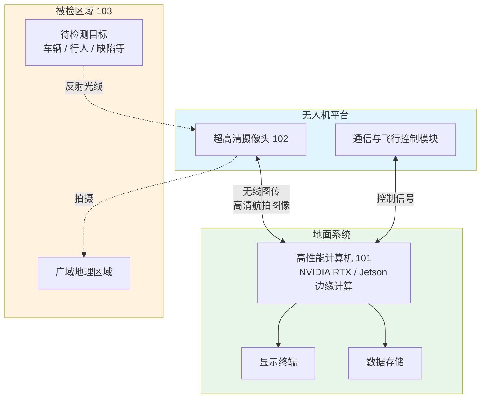
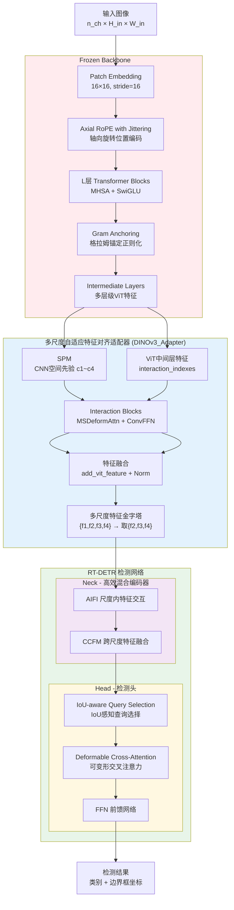
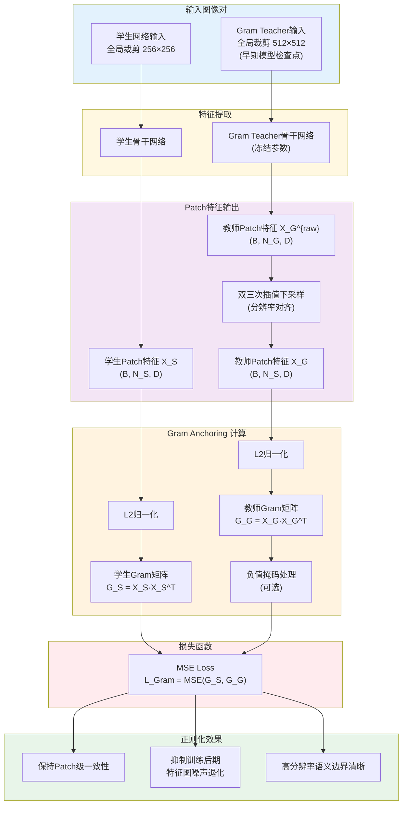
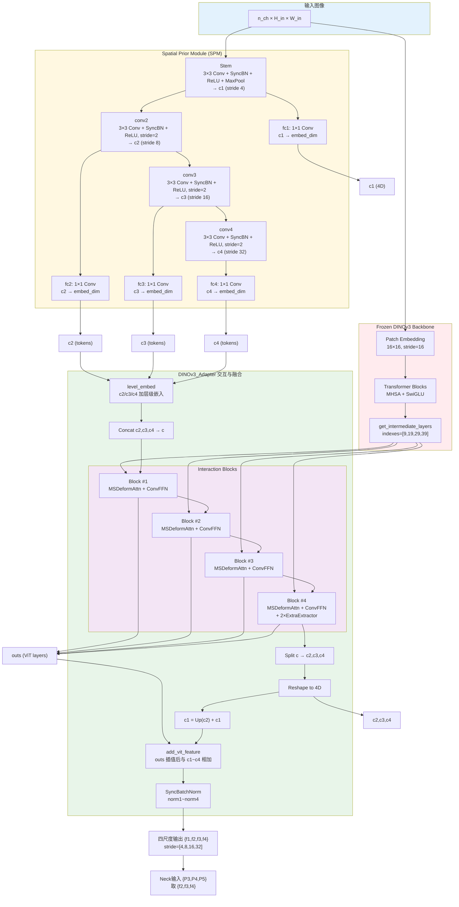
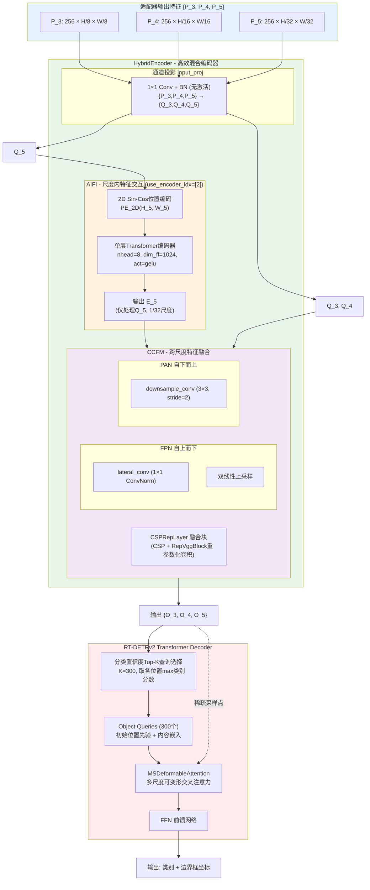
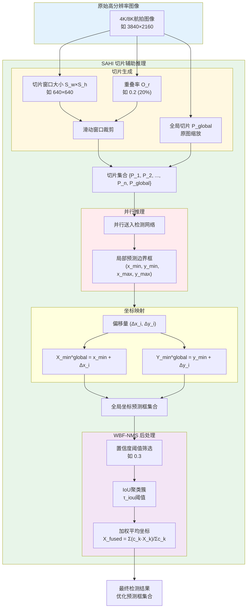

**一种基于DINOv3与RT-DETR及切片推理的航拍图像目标检测方法及装置**

**技术领域**

本发明涉及计算机视觉目标检测领域，具体涉及一种基于DINOv3自监督视觉基础模型、RT-DETR端到端检测器以及融合切片辅助超级推理机制的航拍图像微小目标检测方法及装置。

**背景技术**

目标检测技术作为高效、高精度检测手段，在无人机航拍图像分析与遥感测绘等广域质量检测领域具有广泛应用潜力。目标检测系统依赖摄像头与搭载GPU的计算机或边缘计算设备运行，使得长时间进行高精度、高实时性的空中侦察、交通监控与灾害评估检测成为可能。该技术具有体量轻、易于部署、实时性强的特点，适用于空中安防监控及智能交通等对实时性要求高的领域。

近年来，深度学习技术的快速发展为图像识别和检测提供了强大工具。然而，传统的目标检测器在航拍图像目标检测中存在局限性。现有检测器在有标签数据依赖度和泛化能力方面不够理想，无法满足无人机巡检细分任务的快速部署需求。航拍场景下细分任务繁多，传统方法需针对每个细化任务单独构建大规模标注数据集，导致数据采集、清洗与标注成本高。同时，航拍图像视野广、目标微小密集、背景复杂，进一步加剧了传统监督学习检测方法在准确性和鲁棒性上的不足。因此，开发一种降低标注依赖、提升小目标检测精度与泛化能力的检测方法对航拍图像目标检测具有重要意义。

**发明内容**

针对航拍图像获取容易但标注困难，以及现有航拍目标检测算法存在的对数据标注量依赖大、小目标检测准确性和鲁棒性低、细分任务泛化能力弱、难以快速落地部署等问题，本发明提供了一种基于DINOv3自监督特征提取与RT-DETR及切片辅助推理机制的航拍图像微小目标检测方法及装置。

该方法引入了具有"涌现"特性的DINOv3骨干网络、多尺度自适应特征对齐模块与高效混合编码器模块，能够有效利用从海量无标签图像中学习到的通用特征信息，克服对标注数据依赖度高的行业痛点，显著提升航拍小目标检测的准确性、鲁棒性与跨任务泛化能力。

同时，本发明通过冻结DINOv3骨干网络参数，大幅轻量化整体训练流程，有效降低网络微调的复杂度与对大规模标注数据的依赖，进一步提升训练与推理阶段的计算效率。随着目标检测技术的不断发展与广泛应用，本发明所提出的结合深度学习的航拍小目标检测算法可广泛适配于无人机巡检、广域安防监控等多个领域，有效提升广域安防监控的作业效率与管控质量。

本发明通过如下技术方案来实现。

一种基于DINOv3与RT-DETR及切片推理的航拍图像微小目标检测方法及装置包括：配置高性能显卡的计算机101、航拍摄像头102、被检区域103。计算机与摄像头及接收终端连接，同时接收回传的高清航拍图像，通过深度学习图像检测算法采集航拍图像并进行目标检测。

通过使用基于RT-DETR的目标检测器和DINOv3自监督注意力机制构建网络，由摄像头拍摄被检区域的图像，对目标图像进行目标检测，其实现步骤如下：

**步骤1：图像获取与数据集构建**

由摄像头拍摄被检航拍地面图像，构建数据集$I_{h}$，元素总数为$K$，$K$可以设定为常规数据集大小的10%至20%，其中，$I_{h}$表示有标注的航拍图像目标检测数据集，$K$为数据集中的样本总数。图像原始尺寸大小为$n_{ch} \times h \times w$，其中，$n_{ch}$为图像通道数（RGB图像$n_{ch}=3$），$h$为图像高度，$w$为图像宽度。图像标注使用开源工具X-Anylabeling，标注内容为目标的类别，如"车辆"、"行人"，和目标的左上角及右下角坐标，标注后的信息文件格式为COCO标准格式。

**步骤2.1：网络骨架与主干网络设计**

搭建如图2所示网络模型，深度学习网络模型包括由DINOv3主导的冻结骨架特征提取网络、多尺度特征自适应对齐适配器、混合编码器特征提取网络、以及RT-DETR的检测头结构。

本发明中设计完全冻结主干网络参数，仅将其作为先验特征提取器。使用切片或中心裁剪后尺寸为$n_{ch} \times H_{in} \times W_{in}$的彩色图像作为输入，进入网络模型的DINOv3骨干网络。

输入图像首先通过卷积核大小为16×16、步长为16的块嵌入层，将图像映射为无重叠的特征图块序列。为了提高模型对不同分辨率和航拍图像任意纵横比的鲁棒性，网络注入了带有抖动机制的轴向旋转位置编码。

序列随后经过$L$层Transformer 块（包含多头自注意力MHSA与门控多层感知机SwiGLU），每一层的特征计算如下：

$$X_{l}^{\prime} = X_{l - 1} + \text{MHSA}\left( \text{LayerNorm}\left( X_{l - 1} \right) \right)$$

$$X_{l} = X_{l}^{\prime} + \text{MLP}\left( \text{LayerNorm}\left( X_{l}^{\prime} \right) \right)$$

其中，$X_{l}^{\prime}$为第$l$层多头自注意力模块的输出，$MHSA(\cdot)$表示多头自注意力，$LayerNorm(\cdot)$为层归一化；$X_{l}$为第$l$层的最终输出，$MLP(\cdot)$表示多层感知机。

DINOv3在自监督预训练阶段引入了格拉姆锚定（Gram Anchoring）正则化机制，以解决大模型在长时间训练后密集特征图退化的问题。如图3所示，该机制通过约束学生网络与Gram Teacher网络输出特征之间的成对相似性结构一致性，保持patch级别特征的局部一致性和空间定位精度。

具体地，在学生网络完成前向传播后，选取全局裁剪图像同时送入Gram Teacher网络。该Gram Teacher为训练早期迭代保存的模型检查点（或EMA教师模型），其参数全程冻结。若Gram Teacher采用更高分辨率输入（如$512 \times 512$），则其输出的patch特征将通过双三次插值下采样至与学生网络相同的patch分辨率。随后，对学生patch特征矩阵$X_S$和教师patch特征矩阵$X_G$分别进行L2归一化，并计算各自的Gram矩阵$G_S = X_S \cdot X_S^{\top}$与$G_G = X_G \cdot X_G^{\top}$，其中每个元素代表对应patch特征之间的余弦相似度。最终的Gram损失以均方误差（MSE）度量两个Gram矩阵之间的差异：

$$\mathcal{L}_{\text{Gram}} = \text{MSE}\left( G_S, G_G \right)$$

该损失仅作用于全局裁剪，并与DINO全局损失、iBOT局部损失共同优化，有效抑制训练后期patch特征相似度图的噪声增长，确保输出特征在高分辨率航拍图像中仍保持清晰的语义边界和精确的空间定位。

**步骤2.2：多尺度特征自适应对齐适配器**

传统的RT-DETR以ResNet卷积神经网络为骨干网络，具备天然的8倍、16倍、32倍多层级输出。然而，DINOv3作为纯粹的视觉变换器结构，仅在末端输出单一1/16分辨率的特征图，无法直接满足检测网络对多尺度特征金字塔的需求。

为此，本发明引入DINOv3官方实现的多尺度自适应对齐适配器（DINOv3_Adapter）作为连接冻结骨干网络与RT-DETR颈部的桥梁。该适配器通过空间先验模块（Spatial Prior Module, SPM）提供显式的多尺度空间信息，并借助可变形注意力机制在CNN空间先验与ViT语义特征之间进行深层交互，最终生成包含丰富几何细节与语义信息的多尺度特征金字塔。

该适配器的具体结构与计算流程如下：

首先，构建**空间先验模块（SPM）**。SPM是一个轻量级的卷积金字塔Stem，直接从输入图像中提取多层级空间先验特征$\{c_1, c_2, c_3, c_4\}$，分别对应原图的$1/4$、$1/8$、$1/16$、$1/32$尺度。SPM依次通过堆叠的$3 \times 3$卷积、同步批量归一化（SyncBatchNorm）与ReLU激活，以及步长为2的下采样操作构建卷积层级；最后利用$1 \times 1$卷积将各层特征统一投影至与DINOv3相同的嵌入维度$embed\_dim$。

随后，在DINOv3骨干网络的前向传播过程中，通过`get_intermediate_layers`接口提取指定交互索引层（如第9、19、29、39层）的ViT中间特征$\{x^{(i)}\}$与类别令牌$cls$。适配器在这些中间层位置顺序插入**交互块（InteractionBlockWithCls）**。

每个交互块核心包含一个**提取器（Extractor）**，其工作机理为：
1. **可变形交叉注意力（MSDeformAttn）**：以SPM聚合后的空间先验特征$c$作为查询（Query），以ViT特征$x^{(i)}$作为被查询的特征图（Value），在多个尺度参考点引导下计算稀疏可变形注意力。这使得CNN空间先验能够自适应地从ViT的语义特征中聚合上下文信息。
2. **卷积前馈网络（ConvFFN）**：注意力输出经过层归一化后，进入ConvFFN进行非线性变换。ConvFFN由两个全连接层（$fc_1$、$fc_2$）与中间的三尺度深度可分离卷积（DWConv）组成。DWConv根据$c_2$（1/8）、$c_3$（1/16）、$c_4$（1/32）的token空间比例（16:4:1），将序列分段重塑为二维特征图后进行独立的深度卷积，再展平拼接，从而在不破坏多尺度结构的前提下增强局部特征表达。

最后一个交互块额外配置了两个**附加提取器（Extra Extractors）**，以深化特征提炼。

在交互完成后，聚合特征$c$被重新拆分为$c_2$、$c_3$、$c_4$并恢复为二维特征图。其中，$c_1$通过与$c_2$经转置卷积上采样后的特征进行残差相加得到：

$$c_1 = \text{Up}(c_2) + c_1$$

进一步地，适配器执行**ViT特征增强融合（add\_vit\_feature）**。将各交互层输出的ViT特征$\{x^{(i)}\}$通过双线性插值分别对齐到$c_1$~$c_4$的空间分辨率，然后与对应尺度的SPM特征逐元素相加：

$$f_k = c_k + \text{Interpolate}\left(x^{(i)} \to c_k\text{分辨率}\right), \quad k \in \{1,2,3,4\}$$

最后，通过同步批量归一化层$\text{norm}_1$~$\text{norm}_4$对融合特征进行归一化，输出四尺度特征金字塔：

$$\{f_1, f_2, f_3, f_4\} = \{\text{norm}_1(c_1), \text{norm}_2(c_2), \text{norm}_3(c_3), \text{norm}_4(c_4)\}$$

其空间分辨率分别为原图的$1/4$、$1/8$、$1/16$、$1/32$，通道数均为$embed\_dim$。考虑到后续RT-DETR高效混合编码器的输入需求，本发明选取其中的1/8、1/16、1/32三个尺度作为适配器的最终有效输出，即$\{P_3, P_4, P_5\} = \{f_2, f_3, f_4\}$，其尺寸分别为$embed\_dim \times H_{in}/8 \times W_{in}/8$、$embed\_dim \times H_{in}/16 \times W_{in}/16$和$embed\_dim \times H_{in}/32 \times W_{in}/32$。

**步骤2.3：高效混合编码器与检测头**

在网络模型的颈部中，为实现特征图的高效融合精细调整和进一步降低参数量，引入了RT-DETR的高效混合编码器（HybridEncoder）结构。

首先，颈部对适配器输出的三尺度特征$\{P_{3},P_{4},P_{5}\}$分别施加独立的1×1卷积通道投影层（不含激活函数，仅含批量归一化），将各尺度特征统一投影至隐藏维度$d_{model}=256$，得到投影特征$\{Q_{3},Q_{4},Q_{5}\}$。

随后，混合编码器通过尺度内特征交互模块（AIFI，Attention-based Intra-scale Feature Interaction）独立处理最高语义层特征$Q_{5}$（对应1/32尺度）。该模块首先为$Q_{5}$注入基于温度参数$T=10000$构建的二维正弦余弦位置编码$\text{PE}_{2D}(\cdot)$，再通过具有$n_{head}=8$头注意力、前馈维度$d_{ff}=1024$的单层Transformer编码器，在$Q_{5}$内部所有空间位置词元之间计算全局自注意力，输出增强的高语义特征$E_{5}$：

$$E_{5} = \text{TransEnc}\left( Q_{5} + \text{PE}_{2D}\left( H_{5}, W_{5} \right) \right)$$

其中，$H_{5} = H_{in}/32$、$W_{5} = W_{in}/32$为$Q_{5}$的空间尺寸，$\text{TransEnc}(\cdot)$为Transformer编码器。

然后，跨尺度特征融合模块（CCFM，Cross-scale Feature Fusion Module）接收$E_{5}$以及$Q_{3}$、$Q_{4}$，通过自上而下和自下而上的双向融合路径进行多尺度特征融合：在自上而下的FPN阶段，通过1×1侧向卷积（lateral*conv）与双线性上采样将高层语义逐级传递至浅层；在自下而上的PAN阶段，通过步长为2的3×3卷积（downsample_conv）将细节信息逐级回传至深层。在每个特征融合节点，均采用CSPRepLayer融合块（交叉阶段局部层，内含RepVggBlock重参数化卷积模块）对级联特征进行高效非线性融合，输出强化后的多尺度特征集合$\{O*{3},O*{4},O*{5}\}$。

最后，处理后的多尺度特征被送入RT-DETR解码器。有别于传统DETR的随机查询初始化，本发明采用基于分类置信度的Top-K查询选择机制。解码器对编码器输出的所有特征位置计算类别分类分数，通过取各位置最大类别分数后选取置信度最高的$K=300$个特征位置，作为目标查询（Object Queries）的初始位置先验与内容嵌入。解码器中的多尺度可变形交叉注意力（MSDeformableAttention）模块引导目标查询向量在$\{O_{3},O_{4},O_{5}\}$中的稀疏参考点进行跨尺度特征聚合，最终通过前馈神经网络独立预测每个查询的目标类别与边界框坐标。

**步骤3：非对称微调的训练方法设计**

训练方法包括先加载在数十亿公开数据集上训练的DINOv3预训练模型权重。加载预训练模型后，使用当前任务需要的特定航拍目标数据集。

首先，在训练过程中采用极端的非对称微调策略。完全冻结骨架特征，即DINOv3的所有网络层参数，不参与反向传播的梯度计算。仅解冻并更新多尺度适配器、颈部混合编码器与检测头部分的权重，训练多个迭代周期。

其次，所使用的损失函数整合了分类损失、回归损失与辅助损失。为了提升航拍密集极小目标的定位精度，本发明改进了传统的交并比损失。在回归损失中引入基于归一化瓦瑟施坦距离的回归损失函数。该函数通过将目标边界框的几何形状建模为二维高斯分布，用瓦瑟施坦距离来度量预测框与真实框分布之间的相似性，最终的联合损失函数定义为：

$$\mathcal{L}_{total} = \lambda_{1}\mathcal{L}_{VFL}\left( c,\widehat{c} \right) + \lambda_{2}\mathcal{L}_{L1}\left( b,\widehat{b} \right) + \lambda_{3}\mathcal{L}_{GIoU}\left( b,\widehat{b} \right) + \lambda_{4}\mathcal{L}_{NWD}\left( b,\widehat{b} \right)$$

其中，$\mathcal{L}_{total}$为总损失函数，$\mathcal{L}_{VFL}(\cdot)$为变焦焦点损失（Varifocal Loss）用于分类，能够有效缓解目标与背景样本不平衡的问题；$\mathcal{L}_{L1}(\cdot)$为L1损失，$\mathcal{L}_{GIoU}(\cdot)$为广义交并比损失，$\mathcal{L}_{NWD}(\cdot)$为归一化瓦瑟施坦距离损失；$\lambda_{1},\lambda_{2},\lambda_{3},\lambda_{4}$为各损失项的权重系数；$c,\widehat{c}$分别代表真实类别与预测类别，$b,\widehat{b}$分别代表真实框与预测框的坐标。

**步骤4：切片辅助推理与后处理映射**

首先，定义切片窗口大小为$S_{w} \times S_{h}$，并设定相邻切片间的重叠率阈值$O_{r}$。在原图上通过滑动窗口的模式，裁剪出系列切片集合。为保留大尺寸物体的全局上下文，可将原图整体缩放至$S_{w} \times S_{h}$后作为全局切片并入集合。

其次，将所有切片并行送入包含DINOv3骨干网络与可变形融合通道的检测网络进行特征提取与融合推理。检测头输出针对各切片的局部预测边界框。假设局部切片$P_{i}$在原图中的偏移坐标为$\left( \Delta x_{i},\Delta y_{i} \right)$，网络在切片$P_{i}$中预测到的目标边界框坐标为$(x_{\min}, y_{\min}, x_{\max}, y_{\max})$。后处理阶段首先将该坐标映射回原始高分辨率图像中：

$$X_{\min}^{global} = x_{\min} + \Delta x_{i}$$

$$Y_{\min}^{global} = y_{\min} + \Delta y_{i}$$

其中，$X_{\min}^{global}$、$Y_{\min}^{global}$为原图中的全局坐标，$x_{\min}$、$y_{\min}$为切片中的局部坐标，$\Delta x_{i}$、$\Delta y_{i}$为切片在原图中的偏移量。同理映射最大坐标点。

最后，映射回原图后，由于存在20%的重叠区域以及全局切片的预测，同一物理目标可能产生冗余的预测框。基于置信度阈值进行初步筛选后，采用加权非极大值抑制策略进行预测框去重。对于交并比大于$\tau_{iou}$的高度重叠框聚类簇，并不简单丢弃置信度低的框，而是根据其置信度$c_{k}$计算加权平均坐标：

$$X_{fused} = \frac{\sum_{k}^{}c_{k} \cdot X_{\min,k}}{\sum_{k}^{}c_{k}}$$

其中，$X_{fused}$为融合后的坐标，$c_{k}$为第$k$个边界框的置信度分数，$X_{\min,k}$为第$k$个边界框的最小坐标，$\tau_{iou}$为交并比阈值。最终输出不超过预设最大检测框数量的优化预测结果。获得所描述检测框的坐标位置$(x,y,w,h)$所对应的归一化位置坐标$(X,Y,W,H)$，并将其绘制在测试图像中。若待检测图像输出了检测框，则代表被检航拍区域具有目标；反之，被检区域不具有目标。

相较于传统机器视觉检测算法及基于ImageNet全参微调的YOLO或传统DETR算法，本发明的技术方案具有三个方面的显著进步。首先，通过冻结DINOv3骨干网络，在仅需10%-20%标注数据下即可达到收敛，彻底突破了深度学习在特殊行业落地的标注瓶颈；其次，切片辅助推理与多尺度特征融合机制使得密集小目标的检测召回率和精确率得到了突破性跃升；最后，冻结骨干网络参数使特征提取成为单纯的前向矩阵乘法，保证了推理的实时性和优异的每秒帧数表现。该方法具有低成本、高精度、强实时性和优异泛化能力的优势，适用于航拍小目标检测的实时应用和各类复杂场景，在广域灾害评估、无人机电力巡检等环节上具有广阔的应用前景。

**附图说明**

图1为实施方式中基于DINOv3与RT-DETR的航拍目标检测装置及系统的硬件组成示意图。

图2为实施方式中检测网络整体架构示意图。

图3为实施方式中DINOv3预训练所使用的格拉姆锚定特征正则化原理示意图。

图4为实施方式中多尺度特征自适应对齐适配器网络架构及特征金字塔生成示意图。

图5为实施方式中RT-DETR混合编码器内的尺度内特征交互与跨尺度特征融合模块架构示意图。

图6为实施方式中网络推理阶段切片辅助超级推理机制在图像裁剪与坐标重组后处理阶段的流程示意图。

**具体实施方式**

下面结合附图和实施例对本发明的内容进行详细的描述，但本发明的实际应用形式并不仅限于下述的实施例。

如图1所示，本发明提供了一种基于DINOv3与RT-DETR及切片推理的航拍图像微小目标检测方法及装置，包括：配置高性能显卡的计算机101、超清摄像头102、被检区域103。计算机与摄像头及接收终端连接，同时接收回传的高清航拍图像，通过深度学习图像检测算法采集航拍图像并进行目标检测。

通过使用基于RT-DETR的目标检测器和DINOv3自监督注意力机制构建网络，由摄像头拍摄被检区域的图像，对目标图像进行目标检测，其实现步骤如下：

**步骤1：图像获取与数据集构建**

由摄像头拍摄被检航拍地面图像，构建数据集$I_{h}$，元素总数为$K$，$K$可以设定为常规数据集大小的10%至20%，其中，$I_{h}$表示有标注的航拍图像目标检测数据集，$K$为数据集中的样本总数。图像原始尺寸大小为$n_{ch} \times h \times w$，其中，$n_{ch}$为图像通道数（RGB图像$n_{ch}=3$），$h$为图像高度，$w$为图像宽度。图像标注使用开源工具X-Anylabeling，标注内容为目标的类别，如"车辆"、"行人"，和目标的左上角及右下角坐标，标注后的信息文件格式为COCO标准格式。

**步骤2.1：网络骨架与主干网络设计**

搭建如图2所示网络模型，深度学习网络模型包括由DINOv3主导的冻结骨架特征提取网络、多尺度特征自适应对齐适配器、混合编码器特征提取网络、以及RT-DETR的检测头结构。

本发明中设计完全冻结主干网络参数，仅将其作为先验特征提取器。使用切片或中心裁剪后尺寸为$n_{ch} \times H_{in} \times W_{in}$的彩色图像作为输入，进入网络模型的DINOv3骨干网络。

输入图像首先通过卷积核大小为16×16、步长为16的块嵌入层，将图像映射为无重叠的特征图块序列。为了提高模型对不同分辨率和航拍图像任意纵横比的鲁棒性，网络注入了带有抖动机制的轴向旋转位置编码。

序列随后经过$L$层Transformer Block（包含多头自注意力MHSA与门控多层感知机SwiGLU），每一层的特征计算如下：

$$X_{l}^{\prime} = X_{l - 1} + \text{MHSA}\left( \text{LayerNorm}\left( X_{l - 1} \right) \right)$$

$$X_{l} = X_{l}^{\prime} + \text{MLP}\left( \text{LayerNorm}\left( X_{l}^{\prime} \right) \right)$$

其中，$X_{l}^{\prime}$为第$l$层多头自注意力模块的输出，$MHSA(\cdot)$表示多头自注意力，$LayerNorm(\cdot)$为层归一化；$X_{l}$为第$l$层的最终输出，$MLP(\cdot)$表示多层感知机。

DINOv3在自监督预训练阶段引入了格拉姆锚定（Gram Anchoring）正则化机制，以解决大模型在长时间训练后密集特征图退化的问题。如图3所示，该机制通过约束学生网络与Gram Teacher网络输出特征之间的成对相似性结构一致性，保持patch级别特征的局部一致性和空间定位精度。

具体地，在学生网络完成前向传播后，选取全局裁剪图像同时送入Gram Teacher网络。该Gram Teacher为训练早期迭代保存的模型检查点（或EMA教师模型），其参数全程冻结。若Gram Teacher采用更高分辨率输入（如$512 \times 512$），则其输出的patch特征将通过双三次插值下采样至与学生网络相同的patch分辨率。随后，对学生patch特征矩阵$X_S$和教师patch特征矩阵$X_G$分别进行L2归一化，并计算各自的Gram矩阵$G_S = X_S \cdot X_S^{\top}$与$G_G = X_G \cdot X_G^{\top}$，其中每个元素代表对应patch特征之间的余弦相似度。最终的Gram损失以均方误差（MSE）度量两个Gram矩阵之间的差异：

$$\mathcal{L}_{\text{Gram}} = \text{MSE}\left( G_S, G_G \right)$$

该损失仅作用于全局裁剪，并与DINO全局损失、iBOT局部损失共同优化，有效抑制训练后期patch特征相似度图的噪声增长，确保输出特征在高分辨率航拍图像中仍保持清晰的语义边界和精确的空间定位。

**步骤2.2：多尺度特征自适应对齐适配器**

传统的RT-DETR以ResNet卷积神经网络为骨干网络，具备天然的8倍、16倍、32倍多层级输出。然而，DINOv3作为纯粹的视觉变换器结构，仅在末端输出单一1/16分辨率的特征图，无法直接满足检测网络对多尺度特征金字塔的需求。

为此，本发明引入DINOv3官方实现的多尺度自适应对齐适配器（DINOv3_Adapter）作为连接冻结骨干网络与RT-DETR颈部的桥梁。该适配器通过空间先验模块（Spatial Prior Module, SPM）提供显式的多尺度空间信息，并借助可变形注意力机制在CNN空间先验与ViT语义特征之间进行深层交互，最终生成包含丰富几何细节与语义信息的多尺度特征金字塔。

该适配器的具体结构与计算流程如下：

首先，构建**空间先验模块（SPM）**。SPM是一个轻量级的卷积金字塔Stem，直接从输入图像中提取多层级空间先验特征$\{c_1, c_2, c_3, c_4\}$，分别对应原图的$1/4$、$1/8$、$1/16$、$1/32$尺度。SPM依次通过堆叠的$3 \times 3$卷积、同步批量归一化（SyncBatchNorm）与ReLU激活，以及步长为2的下采样操作构建卷积层级；最后利用$1 \times 1$卷积将各层特征统一投影至与DINOv3相同的嵌入维度$embed\_dim$。

随后，在DINOv3骨干网络的前向传播过程中，通过`get_intermediate_layers`接口提取指定交互索引层（如第9、19、29、39层）的ViT中间特征$\{x^{(i)}\}$与类别令牌$cls$。适配器在这些中间层位置顺序插入**交互块（InteractionBlockWithCls）**。

每个交互块核心包含一个**提取器（Extractor）**，其工作机理为：

1. **可变形交叉注意力（MSDeformAttn）**：以SPM聚合后的空间先验特征$c$作为查询（Query），以ViT特征$x^{(i)}$作为被查询的特征图（Value），在多个尺度参考点引导下计算稀疏可变形注意力。这使得CNN空间先验能够自适应地从ViT的语义特征中聚合上下文信息。
2. **卷积前馈网络（ConvFFN）**：注意力输出经过层归一化后，进入ConvFFN进行非线性变换。ConvFFN由两个全连接层（$fc_1$、$fc_2$）与中间的三尺度深度可分离卷积（DWConv）组成。DWConv根据$c_2$（1/8）、$c_3$（1/16）、$c_4$（1/32）的token空间比例（16:4:1），将序列分段重塑为二维特征图后进行独立的深度卷积，再展平拼接，从而在不破坏多尺度结构的前提下增强局部特征表达。

最后一个交互块额外配置了两个**附加提取器（Extra Extractors）**，以深化特征提炼。

在交互完成后，聚合特征$c$被重新拆分为$c_2$、$c_3$、$c_4$并恢复为二维特征图。其中，$c_1$通过与$c_2$经转置卷积上采样后的特征进行残差相加得到：

$$c_1 = \text{Up}(c_2) + c_1$$

进一步地，适配器执行**ViT特征增强融合（add\_vit\_feature）**。将各交互层输出的ViT特征$\{x^{(i)}\}$通过双线性插值分别对齐到$c_1$~$c_4$的空间分辨率，然后与对应尺度的SPM特征逐元素相加：

$$f_k = c_k + \text{Interpolate}\left(x^{(i)} \to c_k\text{分辨率}\right), \quad k \in \{1,2,3,4\}$$

最后，通过同步批量归一化层$\text{norm}_1$~$\text{norm}_4$对融合特征进行归一化，输出四尺度特征金字塔：

$$\{f_1, f_2, f_3, f_4\} = \{\text{norm}_1(c_1), \text{norm}_2(c_2), \text{norm}_3(c_3), \text{norm}_4(c_4)\}$$

其空间分辨率分别为原图的$1/4$、$1/8$、$1/16$、$1/32$，通道数均为$embed\_dim$。考虑到后续RT-DETR高效混合编码器的输入需求，本发明选取其中的1/8、1/16、1/32三个尺度作为适配器的最终有效输出，即$\{P_3, P_4, P_5\} = \{f_2, f_3, f_4\}$，其尺寸分别为$embed\_dim \times H_{in}/8 \times W_{in}/8$、$embed\_dim \times H_{in}/16 \times W_{in}/16$和$embed\_dim \times H_{in}/32 \times W_{in}/32$。

**步骤2.3：高效混合编码器与检测头**

在网络模型的颈部中，为实现特征图的高效融合精细调整和进一步降低参数量，引入了RT-DETR的高效混合编码器（HybridEncoder）结构。

首先，颈部对适配器输出的三尺度特征$\{P_{3},P_{4},P_{5}\}$分别施加独立的1×1卷积通道投影层（不含激活函数，仅含批量归一化），将各尺度特征统一投影至隐藏维度$d_{model}=256$，得到投影特征$\{Q_{3},Q_{4},Q_{5}\}$。

随后，混合编码器通过尺度内特征交互模块（AIFI，Attention-based Intra-scale Feature Interaction）独立处理最高语义层特征$Q_{5}$（对应1/32尺度）。该模块首先为$Q_{5}$注入基于温度参数$T=10000$构建的二维正弦余弦位置编码$\text{PE}_{2D}(\cdot)$，再通过具有$n_{head}=8$头注意力、前馈维度$d_{ff}=1024$的单层Transformer编码器，在$Q_{5}$内部所有空间位置词元之间计算全局自注意力，输出增强的高语义特征$E_{5}$：

$$E_{5} = \text{TransEnc}\left( Q_{5} + \text{PE}_{2D}\left( H_{5}, W_{5} \right) \right)$$

其中，$H_{5} = H_{in}/32$、$W_{5} = W_{in}/32$为$Q_{5}$的空间尺寸，$\text{TransEnc}(\cdot)$为Transformer编码器。

然后，跨尺度特征融合模块（CCFM，Cross-scale Feature Fusion Module）接收$E_{5}$以及$Q_{3}$、$Q_{4}$，通过自上而下和自下而上的双向融合路径进行多尺度特征融合：在自上而下的FPN阶段，通过1×1侧向卷积（lateral*conv）与双线性上采样将高层语义逐级传递至浅层；在自下而上的PAN阶段，通过步长为2的3×3卷积（downsample_conv）将细节信息逐级回传至深层。在每个特征融合节点，均采用CSPRepLayer融合块（交叉阶段局部层，内含RepVggBlock重参数化卷积模块）对级联特征进行高效非线性融合，输出强化后的多尺度特征集合$\{O*{3},O*{4},O*{5}\}$。

最后，处理后的多尺度特征被送入RT-DETR解码器。有别于传统DETR的随机查询初始化，本发明采用基于分类置信度的Top-K查询选择机制。解码器对编码器输出的所有特征位置计算类别分类分数，通过取各位置最大类别分数后选取置信度最高的$K=300$个特征位置，作为目标查询（Object Queries）的初始位置先验与内容嵌入。解码器中的多尺度可变形交叉注意力（MSDeformableAttention）模块引导目标查询向量在$\{O_{3},O_{4},O_{5}\}$中的稀疏参考点进行跨尺度特征聚合，最终通过前馈神经网络独立预测每个查询的目标类别与边界框坐标。

**步骤3：非对称微调的训练方法设计**

训练方法包括先加载在数十亿公开数据集上训练的DINOv3预训练模型权重。加载预训练模型后，使用当前任务需要的特定航拍目标数据集。

首先，在训练过程中采用极端的非对称微调策略。完全冻结骨架特征，即DINOv3的所有网络层参数，不参与反向传播的梯度计算。仅解冻并更新多尺度适配器、颈部混合编码器与检测头部分的权重，训练多个迭代周期。

其次，所使用的损失函数整合了分类损失、回归损失与辅助损失。为了提升航拍密集极小目标的定位精度，本发明改进了传统的交并比损失。在回归损失中引入基于归一化瓦瑟施坦距离的回归损失函数。该函数通过将目标边界框的几何形状建模为二维高斯分布，用瓦瑟施坦距离来度量预测框与真实框分布之间的相似性，最终的联合损失函数定义为：

$$\mathcal{L}_{total} = \lambda_{1}\mathcal{L}_{VFL}\left( c,\widehat{c} \right) + \lambda_{2}\mathcal{L}_{L1}\left( b,\widehat{b} \right) + \lambda_{3}\mathcal{L}_{GIoU}\left( b,\widehat{b} \right) + \lambda_{4}\mathcal{L}_{NWD}\left( b,\widehat{b} \right)$$

其中，$\mathcal{L}_{total}$为总损失函数，$\mathcal{L}_{VFL}(\cdot)$为变焦焦点损失（Varifocal Loss）用于分类，能够有效缓解目标与背景样本不平衡的问题；$\mathcal{L}_{L1}(\cdot)$为L1损失，$\mathcal{L}_{GIoU}(\cdot)$为广义交并比损失，$\mathcal{L}_{NWD}(\cdot)$为归一化瓦瑟施坦距离损失；$\lambda_{1},\lambda_{2},\lambda_{3},\lambda_{4}$为各损失项的权重系数；$c,\widehat{c}$分别代表真实类别与预测类别，$b,\widehat{b}$分别代表真实框与预测框的坐标。

**步骤4：切片辅助推理与后处理映射**

首先，定义切片窗口大小为$S_{w} \times S_{h}$，并设定相邻切片间的重叠率阈值$O_{r}$。在原图上通过滑动窗口的模式，裁剪出系列切片集合。为保留大尺寸物体的全局上下文，可将原图整体缩放至$S_{w} \times S_{h}$后作为全局切片并入集合。

其次，将所有切片并行送入包含DINOv3骨干网络与可变形融合通道的检测网络进行特征提取与融合推理。检测头输出针对各切片的局部预测边界框。假设局部切片$P_{i}$在原图中的偏移坐标为$\left( \Delta x_{i},\Delta y_{i} \right)$，网络在切片$P_{i}$中预测到的目标边界框坐标为$(x_{\min}, y_{\min}, x_{\max}, y_{\max})$。后处理阶段首先将该坐标映射回原始高分辨率图像中：

$$X_{\min}^{global} = x_{\min} + \Delta x_{i}$$

$$Y_{\min}^{global} = y_{\min} + \Delta y_{i}$$

其中，$X_{\min}^{global}$、$Y_{\min}^{global}$为原图中的全局坐标，$x_{\min}$、$y_{\min}$为切片中的局部坐标，$\Delta x_{i}$、$\Delta y_{i}$为切片在原图中的偏移量。同理映射最大坐标点。

最后，映射回原图后，由于存在20%的重叠区域以及全局切片的预测，同一物理目标可能产生冗余的预测框。基于置信度阈值进行初步筛选后，采用加权非极大值抑制策略进行预测框去重。对于交并比大于$\tau_{iou}$的高度重叠框聚类簇，并不简单丢弃置信度低的框，而是根据其置信度$c_{k}$计算加权平均坐标：

$$X_{fused} = \frac{\sum_{k}^{}c_{k} \cdot X_{\min,k}}{\sum_{k}^{}c_{k}}$$

其中，$X_{fused}$为融合后的坐标，$c_{k}$为第$k$个边界框的置信度分数，$X_{\min,k}$为第$k$个边界框的最小坐标，$\tau_{iou}$为交并比阈值。最终输出不超过预设最大检测框数量的优化预测结果。获得所描述检测框的坐标位置$(x,y,w,h)$所对应的归一化位置坐标$(X,Y,W,H)$，并将其绘制在测试图像中。若待检测图像输出了检测框，则代表被检航拍区域具有目标；反之，被检区域不具有目标。

**相较于传统方法的创新优势**

相较于传统机器视觉检测算法及基于ImageNet全参微调的YOLO或传统DETR算法，本发明的技术方案具有三个方面的显著进步。首先，通过冻结DINOv3骨干网络，在仅需10%-20%标注数据下即可达到收敛，彻底突破了深度学习在特殊行业落地的标注瓶颈；其次，切片辅助推理与多尺度特征融合机制使得密集小目标的检测召回率和精确率得到了突破性跃升；最后，冻结骨干网络参数使特征提取成为单纯的前向矩阵乘法，保证了推理的实时性和优异的每秒帧数表现。该方法具有低成本、高精度、强实时性和优异泛化能力的优势，适用于航拍小目标检测的实时应用和各类复杂场景，在广域灾害评估、无人机电力巡检等环节上具有广阔的应用前景。

---

## 附图示意

下列为专利附图的可渲染流程图与题注。

**图1：** 实施方式中基于DINOv3与RT-DETR的航拍目标检测装置及系统的硬件组成示意图。

**图2：** 实施方式中检测网络整体架构示意图。

**图3：** 实施方式中DINOv3预训练所使用的格拉姆锚定特征正则化原理示意图。

**图4：** 实施方式中多尺度特征自适应对齐适配器网络架构及特征金字塔生成示意图。

**图5：** 实施方式中RT-DETR混合编码器内的尺度内特征交互与跨尺度特征融合模块架构示意图。

**图6：** 实施方式中网络推理阶段切片辅助超级推理机制在图像裁剪与坐标重组后处理阶段的流程示意图。

